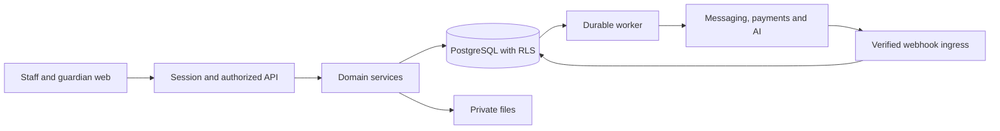

# Architecture

Status: backend stack accepted by Evans, 2026-09-28; remaining architecture is proposed. No stack is installed. Domain behavior: [DOMAIN_RULES.md](DOMAIN_RULES.md).

## 1. System shape

Use a modular monolith: one Node.js/TypeScript backend codebase with NestJS API and worker processes, PostgreSQL as the source of truth, and private object storage. This keeps important commands transactional while limiting pilot operating complexity.

| Layer | Selection / proposal | Rationale |
| --- | --- | --- |
| Web | React, Vite, TypeScript, React Router, Tailwind, accessible shared UI | Selective reuse of demo patterns; mobile school workflows |
| API | Node.js, TypeScript and NestJS; validated DTOs and generated OpenAPI client types | Shared language with the frontend; explicit modules, validation and domain commands |
| Data | PostgreSQL; TypeScript database access and migration tooling selected in P1 | Constraints, transactions, tenant isolation and migration history |
| Identity | Managed OIDC; server session with Secure/HttpOnly cookie | Avoid custom password/MFA recovery infrastructure |
| Jobs | PostgreSQL outbox/jobs and bounded worker | Durable reports, messages and AI runs without a broker initially |
| Files | Private S3-compatible storage | Quarantine/scan, authorized expiring downloads |
| AI | TypeScript server provider adapter and evaluated task templates | Data controls, permissions and budgets |

The backend choice is accepted. Select a supported Node.js LTS release and compatible pinned dependencies during P1. Database tooling must support explicit transactions, tenant-local context, composite foreign keys and reviewed SQL/RLS migrations. Shared TypeScript types do not replace runtime request validation. Keep AI integrations in this backend initially. Exact providers remain open. Defer microservices, Kubernetes, separate vector infrastructure and an autonomous-agent framework.



The diagram shows boundaries; payment initiation can call its adapter through the API. Host web and API under one origin where possible. Propose managed container services, managed PostgreSQL with point-in-time recovery and private storage. Vendor/region/cost remain open; measure Ghana latency and review data-processing arrangements.

## 2. Code and module boundaries

```text
frontend/src/{app,modules,components,lib/api,design}
backend/src/{core,modules,integrations,jobs}
backend/{migrations,tests}
e2e/  fixtures/  scripts/  infra/  docs/
```

This is a future layout, not permission to create empty scaffolding. NestJS feature modules contain their controllers, validated DTOs and services. Domain modules: tenancy/identity, learners, attendance, academics, finance, communication, staffing/scheduling, AI and platform operations. Each owns its writes; other modules use its exported services. Reports may use reviewed cross-module queries. Never create competing copies of balances or grades.

API conventions: `/api/v1/schools/{school_id}/...`; validated school membership; bounded pagination; typed errors with safe code/message and request ID; explicit money currency/minor units. Use commands for submit, approve, post, reverse and publish, rather than generic status edits. Conceal out-of-scope objects consistently. Expected versions prevent stale overwrites; idempotency keys plus payload digests prevent duplicate writes.

Transaction: authorize → validate versions → lock when needed → write domain state + audit + outbox atomically → commit. Network calls stay outside long DB transactions. Jobs are at least once: durable leases, deduplication, retries and dead-letter review. Reconcile uncertain external outcomes before retrying sends/payments.

## 3. Data and tenant isolation

| Domain | Core relationships |
| --- | --- |
| Access | user → membership → school; school → campus; scoped capability grants |
| Learners | application → learner → effective-dated enrolment → class section; guardian ↔ learner through verified rights-bearing links |
| School calendar | academic year → periods → school days/closures; levels separate from sections |
| Learning | curriculum version → learning areas/indicators; assessment policy → assessments/scores/observations; report snapshot; intervention/action/review |
| Attendance | dated register session → learner marks → correction history |
| Finance | fee version → invoices/lines; payment → allocations; credit/debit adjustment; refund/reversal; settlement/reconciliation |
| Operations | staff/teaching assignments, timetable versions, messages/attempts, documents, import/export batches, audit/outbox/jobs, AI runs |

All school-owned records have non-null `school_id`. Global identities/public curriculum references are explicit exceptions. Require tenant-inclusive foreign keys to unique `(school_id, id)` targets. Invoice, learner, allocation, document and related objects cannot cross tenants.

The server establishes tenant context from verified membership; the caller's school ID is not authority. Scope every query and use PostgreSQL RLS as defense in depth. Set context locally within each transaction; missing context fails closed and connection reuse cannot leak it. Runtime roles must not be superusers, owners or BYPASSRLS; separate migration privileges and apply FORCE RLS where appropriate. Workers follow the same tenant and authorization rules.

Keep enrolment history, immutable published reports and financial corrections. Use UUIDs; human numbers are school-scoped unique values. Store UTC event timestamps and date-only birth/attendance dates, displayed in Africa/Accra. Money uses integer pesewas; grade calculations use exact decimals with explicit rounding.

Effective enrolment queries exclude `superseded_at IS NOT NULL`; historical views retain those original intervals and their supersession reasons. Withdrawal before a scheduled transfer supersedes affected plans atomically and records the shortened effective interval without rewriting closed dates. Attendance, class scopes and capacity must use effective intervals; published snapshots retain their original inputs.

Imports stage rows for validation, duplicate review and approval before commit. Never match people solely by name/phone. Opening balances must reconcile to source totals. Exports recheck permissions at generation/download and prevent spreadsheet formula injection. Index tenant plus actual query keys; caches include school, audience and permission context.

## 4. Access, privacy and security

Authorization combines identity, active membership, capability, object relationship and workflow state. Teachers access assigned classes/subjects; accountants get billing identity and finance; front desk gets admission/contact scope; guardians get only permitted linked-child information and published reports. Proprietors do not automatically receive restricted medical/custody/safeguarding access. Grant that separately.

Guardian links distinguish academic, billing, pickup and contact rights. Current links begin pending, require headteacher verification with a reason, and are revoked/replaced rather than edited; staff history is paged/searchable and retains guardian identity. Child responses reevaluate current verified links and return academic fields only with academic rights. A sponsor/payment sender does not become a guardian. Revocation applies to sessions, queued jobs, downloads and AI. Shared/recycled phone numbers need reviewed recovery and verification. Use minimal lock-screen notices. No biometrics or direct child AI accounts in the first pilot.

Use secure sessions, CSRF protection, OIDC validation, privileged MFA, rate limits, output escaping/CSP and private scanned files. Keep credentials in a secret manager. Log minimized audit metadata, not whole medical notes, documents or prompts. Platform support requires a time-limited authorized grant and audit, not standing school-data access.

Before real data, verify current Ghana law, controller/processor roles, registration, child-data conditions, international processing, provider contracts, retention and incident duties. A blanket consent checkbox is insufficient. Do not invent statutory deadlines or Ghana-only hosting requirements. Rights/deletion workflows must cover files, retrieval indexes and restored backups; legally retained history needs reviewed handling.

## 5. AI execution and evaluation

Build structured evidence and permissioned tools from the start. Initial tasks: curriculum-based lesson drafts, factual progress remarks, intervention summaries and authorized operations questions. Numbers come from deterministic domain tools. AI does not post money, publish grades, decide admissions/promotion/discipline, diagnose children or send messages on its own.

Flow: authorized task → permission-filtered facts/resources → minimized model input → schema/citation validation → reviewable draft → explicit approval of any action → reauthorize/check source versions → execute ordinary domain command. Approval binds actor, school, exact payload/targets, source versions and expiry; changes invalidate it.

Read tools expose scoped summaries, not arbitrary SQL or unrestricted HTTP. Filter sources before retrieval and validate access again. Documents are untrusted data; embedded instructions cannot grant permissions. Cite accessible source records/versions, distinguish suggestions from facts, and show missing evidence. Keep public reference material separate from private school content. Confirm reproduction/retrieval rights before ingesting curricula or textbooks.

Persist run ID, actor/school, template/model versions, source references, result/review state, cost and latency. Avoid raw sensitive prompts where unnecessary. Require reviewed provider retention/training terms; no automatic fallback to an unapproved provider. Apply school feature flags, budgets, concurrency/output caps and a kill switch. Manual workflows remain available when AI fails.

Evaluate on synthetic/anonymized Ghana school cases: age-appropriate pedagogy, missing data, factual grounding, arithmetic, malicious documents, cross-school/child access, stale approvals, language quality, outages and costs. Zero successful unauthorized retrieval/actions in the suite is a release gate, not a universal guarantee. Educators approve useful outputs; evaluate again after model/prompt/corpus/tool changes.

## 6. Operations and verification

Use separate local/CI/staging/production resources; synthetic data and sandbox providers outside production. Document real setup/test commands only after they exist. AGENT.md governs migrations, pushes, deployments and real communications.

Verify real PostgreSQL RLS/FKs, financial concurrency, idempotency, API permissions and browser clicks with persisted results. Include at least two schools, shared-user identities, revoked guardian links, restricted downloads and worker retries. Mock tests cannot prove provider acceptance. Aim for accessible mobile interaction and measure performance against agreed pilot devices/load.

Proposed recovery targets: RPO ≤1 hour and RTO ≤4 hours, subject to hosting budget and restore rehearsal. Backups cover database/files and recovery keys. Restores keep external sends disabled, reconcile pending payments and reapply deletion/revocation records before reopening access.

Monitor API failures, queue age, pending payments, reconciliation variance, delivery failures, backup freshness and AI spending. Name incident/support owners before pilot. Onboarding requires roster/balance reconciliation, reviewed school policies and staff training. Offboarding provides authorized export, revokes access/integrations and applies approved retention. Subscription failure uses an agreed grace process; it must not silently delete school records or alter learner fee balances.
